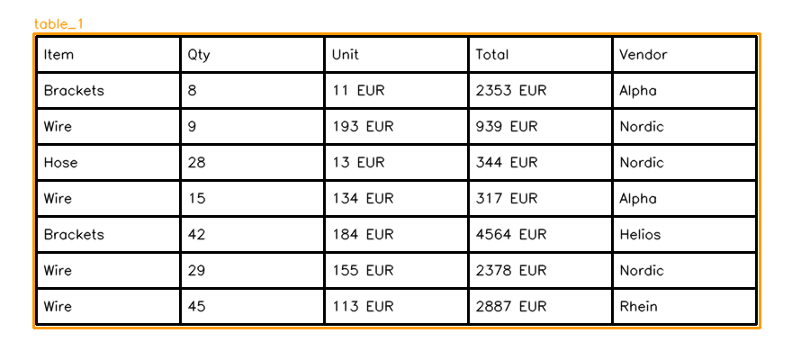

# AI Procurement RAG Lab

Local RAG pipeline for procurement documents with OpenCV table detection and a CLI-first workflow. Designed to show practical document preprocessing + retrieval + generation in a reproducible lab.

## Contents
- [What I Built & Why](#what-i-built--why)
- [Architecture & Flow](#architecture--flow)
- [Components & Versions](#components--versions)
- [Runbook (Setup -> Generate -> Detect -> Index -> Query)](#runbook-setup---generate---detect---index---query)
- [Results & Evidence](#results--evidence)
- [Project Layout](#project-layout)
- [Notes](#notes)

## What I Built & Why
- **Synthetic inputs**: deterministic CSV/PNG/PDF data to make tests repeatable.
- **Table detection**: OpenCV pipeline with debug overlays to QA layout extraction.
- **RAG pipeline**: chunk -> embed (Gemini) -> store (Chroma) -> retrieve -> answer.
- **CLI + n8n orchestration**: automate runs while keeping logic in Python.

## Architecture & Flow
```
Synthetic data -> Table detection -> Chunk + embed -> ChromaDB -> Query + Gemini answer
```

## Components & Versions
- Python 3.x
- OpenCV
- LangChain
- Google Gemini API (embeddings + chat)
- ChromaDB
- n8n (optional orchestration)

## Runbook (Setup -> Generate -> Detect -> Index -> Query)
1) Create a virtualenv:
   ```bash
   cd /path/to/ai-procurement-rag-lab
   python3 -m venv .venv
   source .venv/bin/activate
   ```
2) Install dependencies:
   ```bash
   pip install -r requirements.txt
   ```
3) Add your API key:
   ```bash
   cp .env.example .env
   ```
   Edit `.env` and set `GOOGLE_API_KEY`.
4) Generate synthetic data:
   ```bash
   python data/generate_synthetic.py --out-dir data
   ```
5) Detect tables (debug outputs saved to `outputs/`):
   ```bash
   python main.py detect-tables --image data/synthetic_table.png --out-dir outputs
   ```
6) Index documents:
   ```bash
   python main.py index-docs --data-dir data --persist-dir chroma --collection procurement_docs
   ```
7) Query the index:
   ```bash
   python main.py query \
     --query "Which vendor appears most often in the sample data?" \
     --persist-dir chroma \
     --collection procurement_docs \
     --show-sources
   ```

## Results & Evidence
- Table detection overlay (example output):



## Project Layout
- `data/`: synthetic CSV/PNG/PDF inputs.
- `cv/`: table detection module.
- `rag/`: RAG loader/index/query modules.
- `outputs/`: debug images and table detection outputs.
- `chroma/`: local vector store (generated).
- `main.py`: CLI entry point.
- `n8n/`: workflow and runbook.

## Notes
- Use `--reset` when you want a fresh index.
- `--collection` lets you isolate multiple datasets in the same Chroma store.
